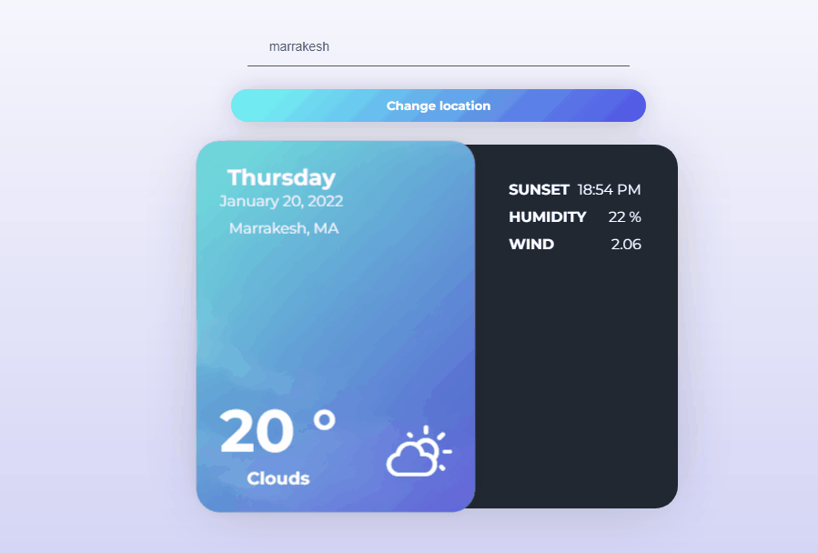

## Weatherio

Weatherio is a Weather Forecast App that shows the current date (Temperature, Wind Speed, Humidity and Sunset Time) for each city built using React. 

- [Demo Website Budgetio](https://budgetio.netlify.app/)

## FEATURES

## Features

Features Done :

- [x] Current Weather

Todo :

- [ ] 5 day Forecast
- [ ] ...

## Built With

- React
- React Bootstrap
- Features Prop Drilling, useEffect, useState and Context, localStorage

## Author

**Bensaad Soukaina**

- [Linkedin](https://www.linkedin.com/in/soukaina-bensaad/ "Linkedin")

